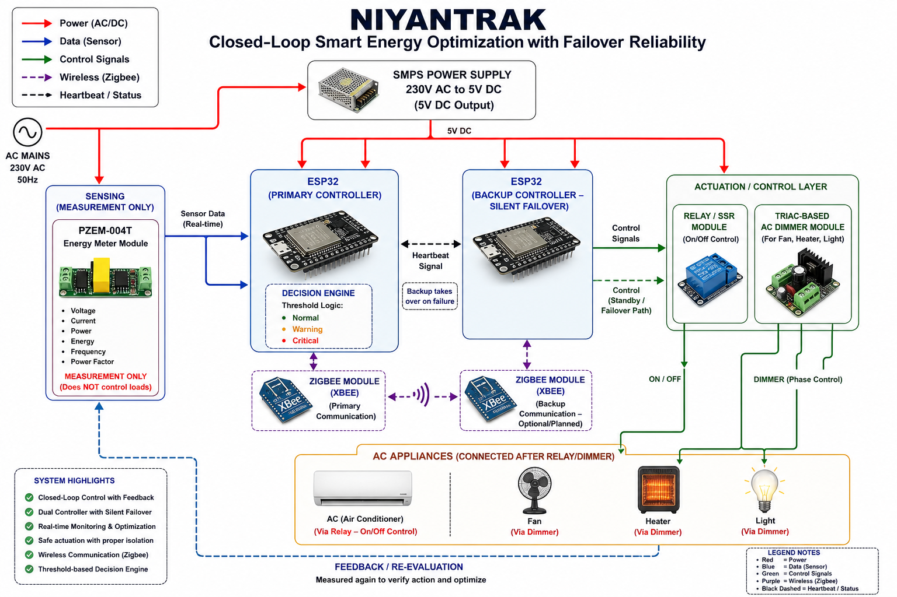

# ⚡ NIYANTRAK
### Control Your Power Before It Controls You

> ESP32-based smart residential energy optimization system for proactive 
> overload prevention featuring dual-controller failover, Zigbee-based 
> device coordination, and adaptive multi-stage optimization — towards a 
> Zero Power-Cut India.

---

## 🔴 The Problem

- 38% of Indian households reported daily power cuts during peak demand 
  periods — LocalCircles Survey, 15,000 households (Bloomberg, May 2024)
- India faces 15-20 GW power shortfall at peak hours — NLDC, 2025
- Existing systems react only after overload occurs — often too late
- No affordable residential solution currently exists for proactive 
  load management

---

## 💡 Our Solution

**NIYANTRAK** continuously monitors real-time energy consumption and takes 
preventive action before overload conditions occur — without disrupting 
user comfort.

Instead of cutting power abruptly, it intelligently adjusts appliance 
parameters (e.g., AC temperature, fan speed, heater level) to bring load 
within safe limits automatically.

> **Core Design Philosophy:** Unlike existing smart energy systems that 
> shift responsibility to the user through apps and dashboards, NIYANTRAK 
> takes full autonomous responsibility for load optimization.
> No app. No manual intervention. No user dependency.
> The system acts — the user benefits.

---

## ⚙️ How It Works

Sense Load → Process via ESP32 → Evaluate Threshold →
Coordinate Devices via Zigbee → Optimize → Stabilize →
Re-evaluate (Feedback Loop)

### Decision Engine — 3 States

| State | Load Range | Action |
|-------|-----------|--------|
| 🟢 NORMAL | < 1500W | All devices at full capacity |
| 🟡 WARNING | 1500W – 2000W | Proactive reduction — Fan 85%, Heater 80%, AC 26°C |
| 🔴 CRITICAL | > 2000W | Multi-stage adaptive optimization |

### Critical State — Priority Order

1. Reduce Heater (highest load consumer)
2. Reduce Fan Speed
3. Raise AC Temperature
4. Cut AC Relay completely (last resort)

---

## 🛠️ Technology Stack

| Component | Purpose |
|-----------|---------|
| ESP32 (Primary) | Main decision engine, load processing |
| ESP32 (Backup) | Silent failover controller |
| PZEM-004T | Real-time energy measurement (V, I, P, Energy, PF) |
| XBee Pro S2C | Zigbee-based wireless device coordination |
| Relay / SSR | Hard ON/OFF control with electrical isolation |
| TRIAC Dimmer | Smooth power reduction for Fan, Heater, Light |
| SMPS (230V→5V) | Isolated power supply for control circuitry |

---

## 🔑 Key Features

- ✅ Real-time load monitoring
- ✅ Proactive overload prevention (not reactive)
- ✅ Multi-appliance coordinated control
- ✅ Silent failover — backup ESP32 takes over seamlessly
- ✅ Fully offline operation (no internet dependency)
- ✅ Maintains user comfort — no abrupt shutoffs
- ✅ Electrical isolation for safe operation
- ✅ Autonomous — no app or dashboard required

---

## 🧠 What Makes NIYANTRAK Different

| Feature | Existing Systems | NIYANTRAK |
|---------|-----------------|-----------|
| Response type | Reactive | Proactive |
| Control scope | Device-level | System-level |
| User dependency | High (app required) | Zero |
| Reliability | Single controller | Dual controller failover |
| Coordination | None | Multi-device via Zigbee |
| Deployment | Industrial/Grid | Residential, affordable |

> *"Not smarter devices — smarter system."*

---

## 📌 Innovation & Patent Scope

NIYANTRAK combines proactive residential load optimization,
autonomous appliance coordination, and silent failover architecture
into a unified low-cost residential energy management system.

Current patent analysis indicates limited focus on:
- residential proactive optimization
- autonomous no-app control systems
- dual-controller failover for household energy management

Further patent landscaping and IP filing are under exploration.

---

## ⚠️ Current Limitations

- Total load measured at one point — not per-appliance
- Rule-based logic (AI/predictive layer is Phase 2)
- Backup Zigbee node is planned, not yet implemented
- Hardware prototype in progress — currently simulation validated
- AC control is indirect (relay/dimmer) not direct protocol
- Single PZEM-004T — multi-circuit monitoring in future scope

---

## 🛡️ Safety

The system uses electrical isolation (Relay/SSR + SMPS) ensuring 
high-voltage power lines are fully separated from low-voltage control 
circuitry for safe real-world deployment.

---

## 📊 Simulation

Live simulation built in **Wokwi** demonstrating:
- Normal → Warning → Critical state transitions
- Multi-stage adaptive optimization
- Failover mechanism (primary → backup at 25s)
- Load stabilization with relay cut

---

## 📐 System Architecture

---

## 📁 Repository Structure

NIYANTRAK-Smart-Energy-System/
├── src/
│   └── niyantrak_v3.2.ino
├── simulation/
│   ├── wokwi_circuit_screenshot.png
│   ├── serial_output_screenshot.png
│   └── simulation_results.csv
├── docs/
│   └── system_architecture.png
├── presentation/
│   └── NIYANTRAK_PPT.pdf
└── README.md

---

## 📊 Current Status

- [x] Concept and system design complete
- [x] Wokwi simulation implemented and validated
- [x] Multi-stage adaptive optimization working
- [x] Dual-controller failover demonstrated
- [x] Documentation and presentation complete
- [ ] Hardware prototype — in progress
- [ ] Zigbee multi-node mesh — upcoming
- [ ] AI/predictive layer — Phase 2

---

## 🌍 Future Scope

- Multi-home neighborhood load balancing
- AI-based demand prediction
- Smart grid integration
- Per-appliance energy analytics
- Utility-provider coordination
- Renewable energy source integration

---

## 👥 Team

| Name |
|------|
| Siri M | 
| Saubalini GV |
| Varsha B | 

---

## 🏫 Institution

Bangalore Institute of Technology  
Department of Electronics and Communication Engineering

---

## 📄 License

This project is licensed under the MIT License — see [LICENSE](LICENSE) 
for details.

---

## 🚀 Vision

**Towards a Zero Power-Cut India through Intelligent Power Optimization.**

*"Control your power before it controls you."*
